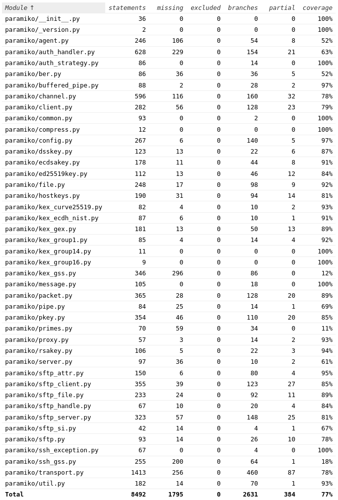

# Report for Assignment 1
## Project chosen

Name: Paramiko

URL: <https://github.com/maciekMerkury/paramiko>

12.175 KLOC, as measured by Lizard

Programming language: Python

## Coverage measurement

### Existing tool
Tool used: Coverage

The tool was run from the command line after cloning the repository locally.

Coverage results before any changes to the repository:

## Coverage improvement

### Individual tests

#### Maciej Mikanik

1. bit_length
<https://github.com/maciekMerkury/paramiko/commit/cd90c44e68d4d30d6c53cd00c50160a9e4a276f5>

Old coverage results

New coverage results
  

The function now has a 100% line and branch coverage, as the previously-ignored case of the `n` not having a bit_length() method is now covered. Furthermore, the case where `hbyte` is 0 is also tested.

2. mod_inverse 

<https://github.com/maciekMerkury/paramiko/commit/ed7709c8efb9328243429974b24553f7a2b9e74f>

Old coverage results

New coverage results
  

This function was originally not covered at all. The branch coverage of this function is now 100%, as the cases used include both a case where `u2` is greater than or equal to and less than zero.

#### Aleksandra Waleńska

1. deflate_long

<https://github.com/maciekMerkury/paramiko/commit/34d715fc3fd9f1768e4c4010a22ecc868e9122ec>

Old coverage results:  

Improved results:
  

Current coverage is 100% since all lines and branches are covered. Previously almost the whole else statement wasn't covered however, now they are covered by the tests fully.

2. constant\_time\_bytes\_eq

<https://github.com/maciekMerkury/paramiko/commit/34d715fc3fd9f1768e4c4010a22ecc868e9122ec>

Old coverage results:
  

Improved results:
  

The current coverage is 100% since all lines and branches are covered. Previously, the if statement wasn't tested at all, now with one simple test it is covered.

#### Mikołaj Pietruczuk

1. _pack

<https://github.com/maciekMerkury/paramiko/pull/1/commits/139443b484d2262ad460d30624a3055489f6a6c4>

Old coverage results:

Improved results:

Current coverage is 100% since all lines and branches are covered. Previously the _flags attribute did not contain the set of FLAG_EXTENDED so the test changed that as a fix,
which results in all the branches being covered.

2. \_debug\_str

<https://github.com/maciekMerkury/paramiko/pull/1/commits/139443b484d2262ad460d30624a3055489f6a6c4>

Old coverage results:

New coverage results:

The function was not covered at all. Now the function has all the branches covered which results in flawless and consistent print of debug strings.

3. \_\_str\_\_

<https://github.com/maciekMerkury/paramiko/pull/1/commits/139443b484d2262ad460d30624a3055489f6a6c4>

Old coverage results:

New coverage results:

Before the test, the function was partially covered, however the majority of branches at the beginning of the function lacked testing. Now, after the tests, the function has almost full branch coverage except for one branch: `if time().time() - self.st_mtime > 15_552_000`. The function coverage before was 8/15 = 53%. After improvements, only one branch is left uncovered, thus the new coverage is 14/15 = 93%

#### Mikołaj Sobczyk

1. \_read\_all

<https://github.com/maciekMerkury/paramiko/commit/afbb2731b397d201758f4d74440478d23a706f06>

Old coverage results
  

New coverage results
  

2. getpeername

<https://github.com/maciekMerkury/paramiko/commit/0634455c07a12d85d72d4dff97abff3889710dc3>

Old coverage results

New coverage results

This function was originally not covered at all. The branch coverage of this function is now 100%. 

### Overall
Old coverage results:  

New coverage results:

## Statement of individual contributions

Each group member contributed to finding a project that fulfilled all the requirements, which, in our case, took a few hours per member. Later, all the members spent time searching for functions that were not too complex and still didn't have full coverage. With the already chosen functions, each member created their own tests and prepared their part of this documentation file.
